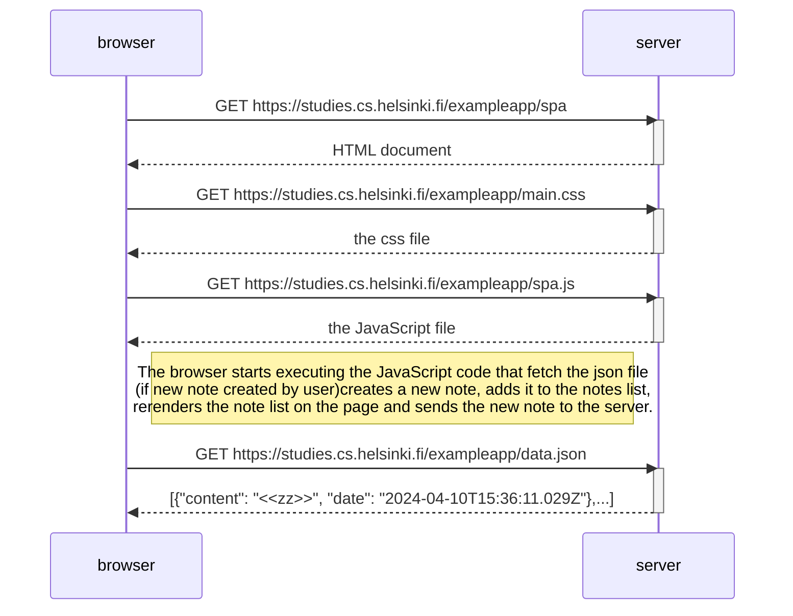

```mermaid
sequenceDiagram
participant browser
participant server

browser->>server: GET https://studies.cs.helsinki.fi/exampleapp/spa
activate server
server-->>browser: HTML document
deactivate server

browser->>server: GET https://studies.cs.helsinki.fi/exampleapp/main.css
activate server
server-->>browser: the css file
deactivate server

browser->>server: GET https://studies.cs.helsinki.fi/exampleapp/spa.js
activate server
server-->>browser: the JavaScript file
deactivate server

Note right of browser: The browser starts executing the JavaScript code that fetch the json file<br>(if new note created by user)creates a new note, adds it to the notes list,<br> rerenders the note list on the page and sends the new note to the server.

browser->>server: GET https://studies.cs.helsinki.fi/exampleapp/data.json
activate server
server-->>browser: [{"content": "<<zz>>", "date": "2024-04-10T15:36:11.029Z"},...]
deactivate server

```

